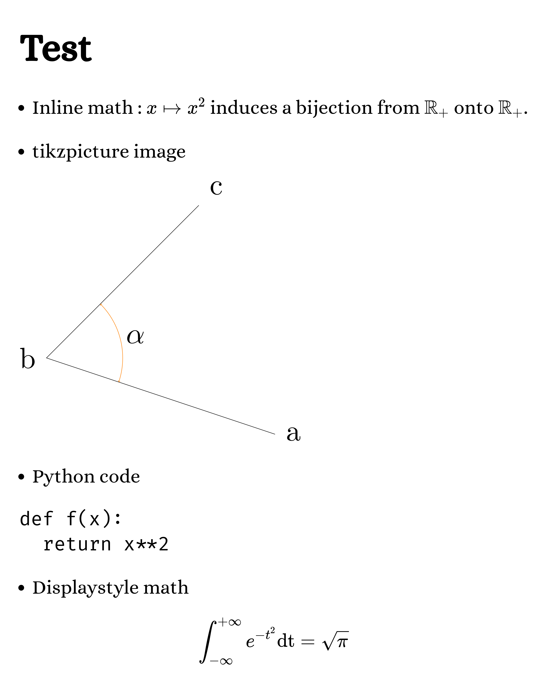
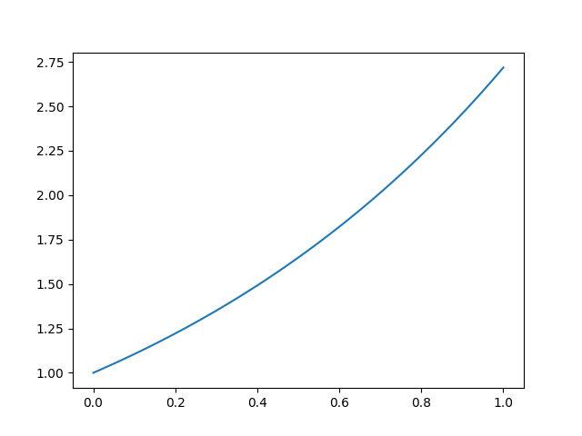

# EulerBot

**Discord** bot for typesetting **LaTeX** and **Python** programming.

[Invite Euler bot](https://discordapp.com/api/oauth2/authorize?client_id=694101689581699165&permissions=387136&scope=bot)

## LaTeX

- The bot renders messages containg LaTeX code. Any message containing at least a pair of dollar signs `$` or `\begin` will be rendered as a PNG image.

- The bot also supports Markdown syntax within $\LaTeX$ messages.

- The bot can also handle `picture` or `tikzpicture` environment with [upmath](https://upmath.me/).

- LaTeX code is rendered by [KaTeX](https://katex.org/). You can specify [KaTeX options](https://katex.org/docs/options.html) with the command `!katex <gistid>` where `<gistid>` is the id of a public gist containing a JSON object.

- Example of a **Discord** message and the generated image.

~~~plain
# Test

- Inline math : $x\mapsto x^2$ induces a bijection from $\mathbb R_+$ onto $\mathbb R_+$.

- tikzpicture image

\usetikzlibrary{quotes,angles}
\begin{tikzpicture}[thick,scale=5, every node/.style={scale=5}]
  \draw
    (3,-1) coordinate (a) node[right] {a}
    -- (0,0) coordinate (b) node[left] {b}
    -- (2,2) coordinate (c) node[above right] {c}
    pic["$\alpha$", draw=orange, <->, angle eccentricity=1.2, angle radius=1cm]
    {angle=a--b--c};
\end{tikzpicture}

- Python code

```python
def f(x):
  return x**2
```

- Displaystyle math
$$
\int_{-\infty}^{+\infty}e^{-t^2}\mathrm{dt}=\sqrt\pi
$$
~~~



- Example of a katex gist

~~~json
{
  "macros": {
    "\\cC": "\\mathcal{C}",
    "\\cD": "\\mathcal{D}",
    "\\cP": "\\mathcal{P}",
    "\\la": "\\lambda",
    "\\va": "\\varphi",
    "\\dF": "\\mathbb{F}",
    "\\dK": "\\mathbb{K}",
    "\\dN": "\\mathbb{N}",
    "\\dQ": "\\mathbb{Q}",
    "\\dR": "\\mathbb{R}",
    "\\dC": "\\mathbb{C}",
    "\\dU": "\\mathbb{U}",
    "\\dZ": "\\mathbb{Z}",
    "\\lb": "\\left[\\!\\left[",
    "\\rb": "\\right]\\!\\right]",
    "\\card": "\\operatorname{card}",
    "\\vect": "\\operatorname{vect}",
    "\\dim": "\\operatorname{dim}",
    "\\deg": "\\operatorname{deg}",
    "\\ident": "\\operatorname{Id}",
    "\\stab": "\\operatorname{Stab}",
    "\\Im": "\\operatorname{Im}",
    "\\Ker": "\\operatorname{Ker}",
    "\\conj": "\\overline",
    "\\te": "\\theta",
    "\\eps": "\\epsilon",
    "\\si": "\\sigma",
    "\\al": "\\alpha"
  }
}
~~~

- The bot's message is updated/deleted whenever the author's message is updated/deleted.

## Python

- Use the `!python` command to interpret Python code.

- Example of a Python message and generated output

~~~plain
!python
def doubles(l):
  return [2*x for x in l]
print(doubles(range(10)))
~~~

---

**Code**

~~~python
def doubles(l):
  return [2*x for x in l]
print(doubles(range(10)))
~~~

**Sortie**

~~~python
[0, 2, 4, 6, 8, 10, 12, 14, 16, 18]
~~~

- You can use the `numpy` package.

- You can also the `matplotlib` package. Each call to `show()` will generate an image.

- Example of a message using `numpy` and `matplotlib`and the generated output.

~~~plain
!python
import numpy as np
import matplotlib.pyplot as plt
X=np.linspace(0,1,100)
Y=np.exp(X)
plt.plot(X,Y)
plt.show()
~~~

---

**Code**

~~~python
import numpy as np
import matplotlib.pyplot as plt
X=np.linspace(0,1,100)
Y=np.exp(X)
plt.plot(X,Y)
plt.show()
~~~

**Sortie**

~~~python
python
~~~

